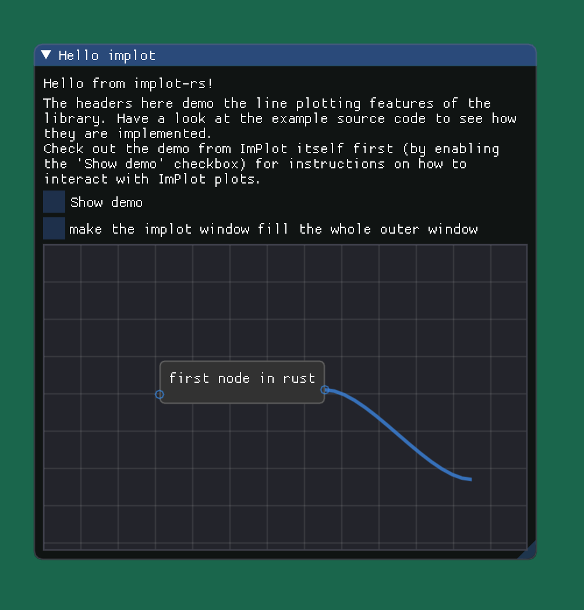

# imnodes-rs


big thanks to 4bb4 for [implot-rs](https://github.com/4bb4/implot-rs) !

its working :) ( image is outdated, works even more now ;) )



# docs
`cargo doc --no-deps --open`

# TODO/ Ideas
- port original examples
- BeginStaticAttribute
- IsAttributeActive
- IsanyAttributeActive
- save/ load
- IO
- Mouse/ Modifier
- Style destroy 

- filter bindgen output?

- review all the scoped functions / implement them all e.g. search for `== Scope_None` in `imnodes.cpp`
- handle node connection/ nice helpers


nice to have:
- use Serde to make it possible to declare graphs and render them
    - load and save as well
- look into issue around global variable/ mutex/ multithreading/ api design
- add comments to everything
- add exmaples in Readme and executables
- multiple editors working?
- review types in unsafe code
- expose API like the original imgui api? 

# Example (see `imnodes-wgpu-examples/src/ui.rs`)

```rust
use imgui::{im_str, Ui};
use imnodes::*;

pub fn show_basic_node(ui: &Ui, context: &imnodes::Context) {
    set_style_colors_classic(&context);
    let mut id_gen = IdentifierGenerator::new();

    let first_node = id_gen.next_node();
    let second_node = id_gen.next_node();

    let output1 = id_gen.next_output_pin();
    let input1 = id_gen.next_input_pin();

    let links = [(input1, output1)];
    let links = links
        .iter()
        .map(|(from, to)| (from, to, id_gen.next_link()))
        .collect::<Vec<_>>();

    let on_snap = push_attribute_flag(AttributeFlag::EnableLinkCreationOnSnap, &context);
    let detach = push_attribute_flag(AttributeFlag::EnableLinkDetachWithDragClick, &context);

    let outer_scope = editor(&context, |editor| {
        editor.node(first_node, |node| {
            node.titlebar(|| {
                ui.text(im_str!("Node 1: not movable node in rust"));
            });

            ui.text(im_str!("text in the node"));
            ui.spacing();

            node.input(input1, PinShape::Circle, || {
                ui.text(im_str!("Input 1"));
            });

            node.output(id_gen.next_output_pin(), PinShape::Triangle, || {
                ui.text(im_str!("Output 1"));
            });

            node.output(id_gen.next_output_pin(), PinShape::QuadFilled, || {
                ui.text(im_str!("Output 2"));
            });
        });

        first_node.set_draggable(false);
        first_node.set_position(500.0, 30.0, CoordinateSystem::GridSpace);

        let color = push_color_style(ColorStyle::TitleBar, [0.0, 1.0, 0.0], &context);
        let text_color = ui.push_style_color(imgui::StyleColor::Text, [0.0, 0.0, 0.0, 1.0]);
        editor.node(second_node, |node| {
            node.titlebar(|| {
                ui.text(im_str!("Node 2: move me"));
            });
            color.end();
            text_color.pop(&ui);

            node.input(id_gen.next_input_pin(), PinShape::Circle, || {
                ui.text(im_str!("Some Input"));
            });

            node.output(output1, PinShape::Triangle, || {
                ui.text(im_str!("Output 1"));
            });

            node.output(id_gen.next_output_pin(), PinShape::QuadFilled, || {
                ui.text(im_str!("Output 2"));
            });
        });

        for (input, output, link_id) in links {
            editor.link(link_id, *input, *output);
        }
    });

    // if outer_scope.is_hovered(first_node) {
    //     println!("node one hovered");
    // }
    // if outer_scope.is_hovered(second_node) {
    //     println!("node two hovered");
    // }

    // if outer_scope.is_hovered(input1) {
    //     println!("input1  hovered");
    // }
    // if outer_scope.is_hovered(output1) {
    //     println!("output1  hovered");
    // }

    // // or also possible to call on links
    // if links[0].2.unwrap().is_hovered(&outer_scope) {
    //     println!("link1  hovered");
    // }

    // println!("selected nodes: {:?}", outer_scope.selected_nodes());
    // println!("selected links: {:?}", outer_scope.selected_links());

    // you have to draw bettween an input and an output and then let go, then it works
    // this can be customized using AttributeFlag
    if let Some(link) = outer_scope.links_created() {
        println!("added {:?}", link);
    }

    if let Some(link) = outer_scope.link_removed() {
        println!("removed {:?}", link);
    }

    on_snap.end();
    detach.end();
}
```